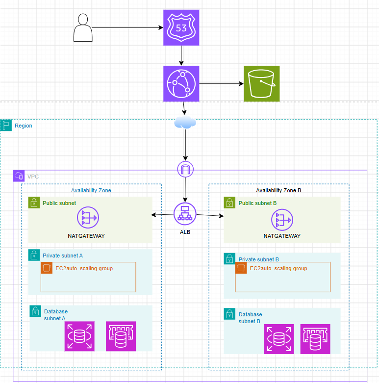

# RetailEdge — AWS Migration Project

Solutions Architect simulation: migrating a mid-size e-commerce company
from 3 bare-metal servers to a Multi-AZ, Three-Tier AWS architecture.

> Hands-on practice project (not a polished client deliverable).
> The Console walkthrough was done in **us-east-1**; the Terraform code was
> tested (`validate` + `plan`) in **eu-west-1**.


## Layer 1 — Architecture Design

Designed a Multi-AZ, three-tier AWS architecture and evaluated
migration strategy per component (Rehost for the web tier, Replatform
for the app tier and the database). TCO analysis projected ~74% cost
reduction over 3 years compared to the current on-premises setup.

Full details: [layer-1-design/console-steps.md](./layer-1-design/console-steps.md)

---

## Layer 2 — Network Foundation & Security

Built a VPC (10.0.0.0/16) with 6 subnets across 2 Availability Zones,
an Internet Gateway, 2 NAT Gateways, and 4 route tables enforcing
strict tier isolation (public, private, database). Created 3
chained security groups (alb-sg → app-sg → rds-sg) so each tier only
accepts traffic from the tier directly in front of it.

Full details: [layer-2-network/console-steps.md](./layer-2-network/console-steps.md)

## Layer 3 — Compute & Auto Scaling

Built a Launch Template, Application Load Balancer, Target Group,
and Auto Scaling Group (min=2, max=10) serving a PHP application on
port 8080 behind the ALB on port 80. Configured a target tracking
scaling policy (60% CPU) and a scheduled scaling action for Friday
evenings, then verified the site serves traffic correctly through
the ALB.

Full details: [layer-3-compute/console-steps.md](./layer-3-compute/console-steps.md)

## Layer 4 — Data Layer & Migration

Provisioned RDS MySQL Multi-AZ (`retailedge-db`) with encrypted
storage and 7-day backups, plus an ElastiCache Redis cluster
(`retailedge-cache`) with 2 nodes, Multi-AZ and encryption at rest
and in transit. Wrote a 4-phase migration cutover plan (Full Load,
CDC, Cutover, Rollback) achieving near-zero RPO and under 2-minute RTO.

Full details: [layer-4-data/console-steps.md](./layer-4-data/console-steps.md) | [Migration Plan](./layer-4-data/migration_plan.md)

## Layer 5 — CI/CD Pipeline & Go-Live

Containerized the application with Docker and built a GitHub
Actions workflow (test → build → deploy). The workflow is
**manually triggered** (`workflow_dispatch`): there is no AWS OIDC
role set up, so the deploy and rollback steps are **designed and
documented, not provisioned** (the commands are commented out).
Wrote a Go-Live checklist and a safe DNS cutover plan using
Route 53 weighted routing.

### CloudWatch Alarms

The Task defines 4 alarms. Created in the Console vs. designed only:

| Alarm | Metric | Threshold | Status |
|-------|--------|-----------|--------|
| High Latency | ALB P95 Latency | > 800ms for 5 min | Created |
| DB CPU Spike | RDS CPUUtilization | > 80% | Created |
| High Error Rate | ALB 5xx Rate | > 1% | Designed (not deployed) |
| Low Cache Hit Rate | ElastiCache Hit Rate | < 70% | Designed (not deployed) |

Full details: [layer-5-cicd/console-steps.md](./layer-5-cicd/console-steps.md)

---

## Terraform (Infrastructure as Code)

Terraform code lives in [`Terraform/`](./Terraform) (region `eu-west-1`).
Only `terraform validate` and `terraform plan` were run
(**no full `apply`**; apply was only tried once on VPC + subnet to test).
The code is organised as modules instead of the flat files in the
Task's starter structure.

```
Terraform/
├── provider.tf, main.tf, variables.tf, terraform.tfvars
└── modules/
    ├── Network   # VPC, 6 subnets, IGW, 2 NAT, route tables, alb/app/db SGs
    ├── Compute   # Launch Template, ALB, Target Group, ASG, scaling
    └── Data      # RDS MySQL Multi-AZ, ElastiCache Redis (2 nodes, Multi-AZ)
```

Latest result: `Plan: 39 to add, 0 to change, 0 to destroy.`

Notes:
- `alb_sg` allows inbound 80 and 443. The Task asks for 443 only; port 80
  is an optional addition because the ALB listener is HTTP (no ACM
  certificate in this practice setup).
- The database security group is named `db_sg` in the code (`rds_sg` in
  the Task).
- Compute includes Target Tracking (60% CPU) and a scheduled action
  (desired capacity = 6 every Friday 20:00 UTC) as the Task 3.4 bonus.
- ElastiCache Multi-AZ (`multi_az_enabled` + `automatic_failover_enabled`)
  is an optional addition; the Task only requires 2 nodes + encryption.
- RDS master password is managed by AWS Secrets Manager
  (`manage_master_user_password = true`), so no password is stored in code.